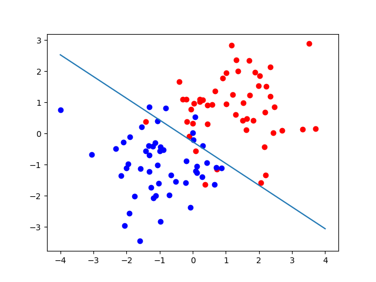

# Perceptron
From Wikipedia:

* *"In machine learning, the perceptron is an algorithm for supervised learning of binary classifiers. A binary classifier is a function which can decide whether or not an input, represented by a vector of numbers, belongs to some specific class.[1] It is a type of linear classifier, i.e. a classification algorithm that makes its predictions based on a linear predictor function combining a set of weights with the feature vector."* *

This project imlements a standard perceptron algorithm for binary classification.

## Features:
 - N-dimentinal input data.
 - Binary classification bewteen class "0" and class "1".
 - Random initialization of weights.
 - Custom Loss Functions.
 - Custom Activation Functions.
 - l1 and l2 regularization.

## Example
$x \in \mathbb{R}^2$ is a dataset generated qith two classes generated by one of two multivaraite gaussian distributions with means $\mu_1=(1,1)$ and $\mu_2=(-1,-1)$ and equal covariance matrix $C$ equal to the indentety matrix.
$y$ is the coresponding vector indicating 1 for class 1 and 0 for class 2.

The perceptron greates a linear decicion boundry seperating a new dataset into class 1 if above the line and class 2 if bellow the line. The picture bellow shows the resulting decicion boundry and the training points.

